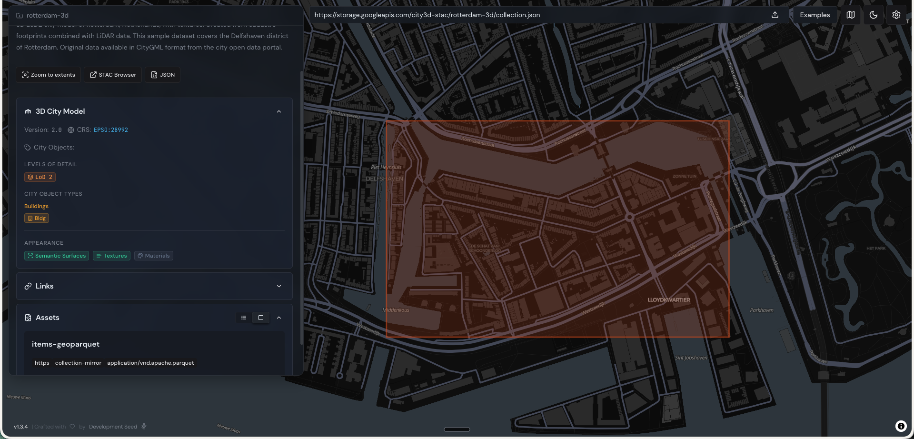

# City3D STAC Open Data Registry

Public registry of 3D city model dataset definitions used to generate STAC catalogs,
collections, and items.

This repository is separate from the generator implementation. The CLI lives in the
`city3d-stac-tool` git submodule, which points to `git@github.com:HideBa/city3d-stac-tool.git`.

Canonical registry repository:
`https://github.com/cityjson/city3d-stac-registry`

## Repository Layout

```text
.
├── catalog/
│   └── catalog-config.yaml
├── collections/
│   └── *.yaml
├── manifests/
│   └── *_urls.txt
├── docs/
├── city3d-stac-tool/
└── .github/workflows/
```

## Map viewer
Config files registered in this repository automatically generate STAC catalogs, collections, and items. The generated STAC assets can be previewed on [https://cityjson.github.io/city3d-stac-map/](https://cityjson.github.io/city3d-stac-map/). 



## Local Usage

Initialize submodules first:

```bash
git submodule update --init --recursive
```

Install the CLI as a native binary with Cargo:

```bash
cargo install --git ssh://git@github.com/HideBa/city3d-stac-tool.git --bin city3dstac
```

Validate a collection config:

```bash
cargo run --manifest-path city3d-stac-tool/Cargo.toml -- \
  collection --config collections/rotterdam-config.yaml --dry-run
```

Validate the catalog config:

```bash
cargo run --manifest-path city3d-stac-tool/Cargo.toml -- \
  catalog --config catalog/catalog-config.yaml --dry-run
```

Generate the published catalog locally:

```bash
cargo run --manifest-path city3d-stac-tool/Cargo.toml -- \
  catalog --config catalog/catalog-config.yaml -o build/site
```

Rebuild collection metadata from existing generated item JSON files, without
downloading or regenerating items:

```bash
scripts/generate-catalog.sh --collections-only
```

Use a collection config stem to rebuild one collection, for example
`scripts/generate-catalog.sh --collections-only japan-plateau`. Rebuild the
root catalog afterwards with `scripts/generate-catalog.sh --catalog-only`.

## Contribution Model

- Add or update dataset definitions in `collections/`.
- Update `catalog/catalog-config.yaml` when a dataset should appear in the published catalog.
- Keep generated STAC JSON out of git; CI publishes it from the source configs.
- Commit supporting URL manifests in `manifests/` when a dataset is too large to maintain inline.

See [CONTRIBUTING.md](CONTRIBUTING.md) and [docs/publishing.md](docs/publishing.md).
